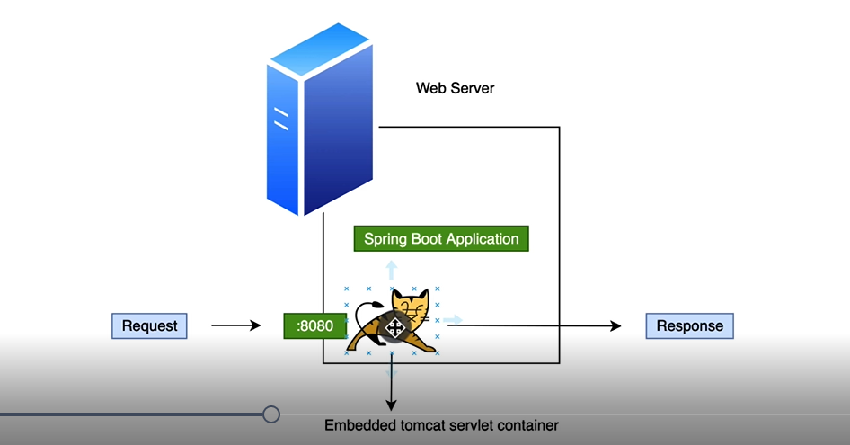

# What is Tomcat?
Apache Tomcat is a free and open-source implementation of the Jakarta Servlet,
Jakarta Expression Language, and WebSocket technologies.

It provides a "pure Java" HTTP web server environment in which Java code can also run.

Thus, it's a web application server.

