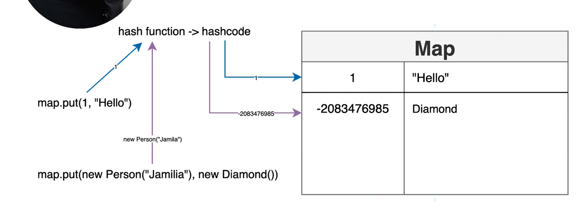

HashCode and HashFunction
-

- HashFunction is a function that produces HashCode.
- Hashcode means mapping an object to its integer value.
- You can call the hash function on the same object and it will always produce the same hashCode!
- When you say map.put(1,"Hello"), 1 goes through the hashfunction and it produces the hashcode.
- For integers, hashcode is the number itself, but with different objects, a produced hashcode is complicated!
